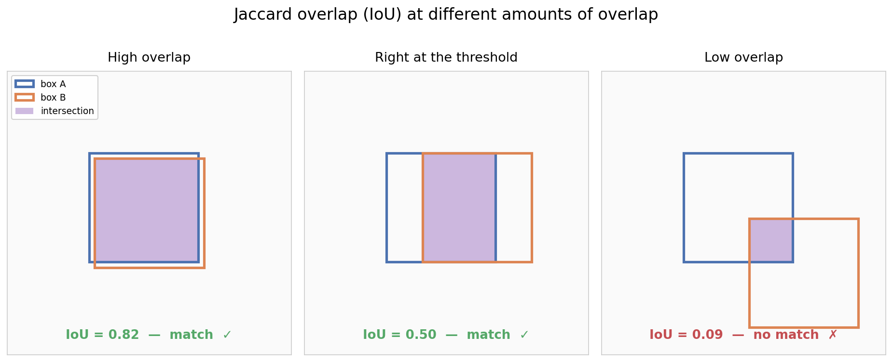

# Exercise 05: Object Detection with Faster R-CNN

## Overview

In this exercise, you will build an end-to-end object detection pipeline using Faster R-CNN on the [PhenoBench](https://www.phenobench.org/) dataset — a UAV-based agricultural dataset for detecting crops (sugar beet) and weeds. Unlike classification, detection requires localizing *where* objects are in the image and classifying *what* they are, simultaneously.

This exercise builds on everything from Exercises 03–04 but introduces several new concepts specific to detection.

**Estimated time:** 1.5–2 hours

**Prerequisites:** Exercise 03 (classification pipeline), Exercise 04 (model factory)

**References:**
- [PyTorch detection reference](https://github.com/pytorch/vision/tree/main/references/detection) — official torchvision detection training scripts
- [A PyTorch Tutorial to Object Detection](https://github.com/sgrvinod/a-PyTorch-Tutorial-to-Object-Detection) — SSD implementation from scratch with detailed explanations

**File structure:**
```
exercise_05/
├── README.md                 ← You are here
├── config.yaml               ← Detection configuration
├── submit_slurm.sh              ← Slurm submission script for training
├── submit_slurm_eval.sh         ← Slurm submission script for evaluation on testset
├── src/
│   ├── dataset.py            ← TODO: Detection dataset (COCO JSON)
│   ├── visualize_dataloader.py ← Fully coded (visualize the training data with bboxes before training)
│   ├── transforms.py         ← TODO: Detection-specific transforms
│   ├── model.py              ← TODO: Detection model factory
│   ├── train.py              ← TODO: Training loop
│   ├── evaluate.py           ← TODO: COCO evaluation
│   └── utils.py              ← Fully coded (collate_fn, helpers)
├── solutions/
├── optional/
│   ├── visualize_predictions.py
│   └── faster_rcnn_backbones.py
├── data/                     ← Symlink to shared dataset
└── outputs/
    ├── checkpoints/
    └── logs/
```

---

## Dataset Setup

The PhenoBench detection dataset is pre-processed on the server with COCO-format bounding box annotations. These were pre-extracted from PhenoBench's instance segmentation masks — each unique plant instance in the mask was converted to its tightest enclosing bounding box and labelled as crop or weed using the semantic mask. The COCO JSON files are already prepared on the server; you do not need to run this conversion.

Note that while annotations are stored in COCO format (`[x, y, width, height]`) on disk, the Dataset class converts them to `[x1, y1, x2, y2]` format internally, which is what Faster R-CNN and all other torchvision detection models expect.

Create a symlink:

```bash
ln -s /ai2_ex/data/detection/phenobench_256 data/phenobench_256
```

### Expected Folder Structure

```
data/phenobench/
├── annotations/
│   ├── train.json            ← COCO JSON annotations
│   └── val.json
├── train/
│   └── images/               ← RGB images (1024×1024)
└── val/
    └── images/
```

### Classes

| Category ID | Class | Description |
|-------------|-------|-------------|
| 0 | background | Reserved by Faster R-CNN (not in annotations) |
| 1 | crop | Sugar beet plants |
| 2 | weed | Weed plants |

---

# Part I: Concepts

---

## 1. From Classification to Detection

Every component of the pipeline changes when moving from image classification to object detection. Understanding these differences is essential before writing the code.

### What the model predicts

**Classification:** One label per image → "this image contains a tomato leaf with blight."

**Detection:** Multiple objects per image, each with a bounding box and a class label → "there is a crop at [x1, y1, x2, y2] and two weeds at [x3, y3, x4, y4] and [x5, y5, x6, y6]."

The model output is no longer a single vector of class probabilities. Instead, it is a list of detections, each consisting of a bounding box (4 coordinates), a class label, and a confidence score.

### Annotation format

Classification used folder names as labels. Detection requires explicit annotation files that describe the location and class of every object in every image.

The COCO format is the standard. Each JSON file contains three sections:

```json
{
  "images": [
    {"id": 1, "file_name": "image_001.png", "width": 1024, "height": 1024}
  ],
  "annotations": [
    {
      "id": 1,
      "image_id": 1,
      "category_id": 1,
      "bbox": [120, 340, 80, 95],
      "area": 7600,
      "iscrowd": 0
    }
  ],
  "categories": [
    {"id": 1, "name": "crop"},
    {"id": 2, "name": "weed"}
  ]
}
```

The `bbox` field uses the format `[x, y, width, height]` where (x, y) is the top-left corner. Faster R-CNN expects boxes in `[x1, y1, x2, y2]` format internally, so the Dataset class must convert.

---

## 2. How the Dataset Changes

In classification, `__getitem__` returned `(image_tensor, label_integer)`.

In detection, `__getitem__` returns `(image_tensor, target_dict)` where the target is a dictionary:

```python
target = {
    "boxes":    FloatTensor of shape [N, 4],   # [x1, y1, x2, y2] per object
    "labels":   Int64Tensor of shape [N],       # class ID per object
    "image_id": Int64Tensor of shape [1],       # unique image identifier
    "area":     FloatTensor of shape [N],       # area of each box
    "iscrowd":  UInt8Tensor of shape [N],       # 0 for all in this dataset
}
```

where N is the number of objects in that image. Different images have different values of N.

---

## 3. How the DataLoader Changes

In classification, the default `collate_fn` stacks all images into a single tensor of shape `(B, C, H, W)` and all labels into `(B,)`. This works because every image produces exactly one label.

In detection, images have different numbers of objects, so target dicts cannot be stacked into a uniform tensor. A **custom `collate_fn`** is needed that returns a tuple of lists instead:

```python
def collate_fn(batch):
    return tuple(zip(*batch))
# Returns: (tuple of images, tuple of target dicts)
```

---

## 4. How Transforms Change

In classification, transforms only affect the image — flipping, cropping, or resizing the image does not change the label "tomato blight."

In detection, **bounding boxes must transform with the image.** If you horizontally flip an image, every bounding box's x-coordinates must also be flipped. If you resize the image, all box coordinates must be scaled proportionally. This means transforms operate on `(image, target)` pairs, not just images.

---

## 5. How the Loss Changes

In classification, you defined a single loss function (`CrossEntropyLoss`) and called it explicitly:

```python
loss = criterion(outputs, labels)
```

Faster R-CNN handles loss computation internally. In training mode, you pass both images and targets to the model, and it returns a dictionary of losses:

```python
# Training
loss_dict = model(images, targets)
# loss_dict = {"loss_classifier": ..., "loss_box_reg": ...,
#              "loss_objectness": ..., "loss_rpn_box_reg": ...}
total_loss = sum(loss_dict.values())
```

In evaluation mode, you pass only images, and it returns predictions:

```python
# Evaluation
model.eval()
predictions = model(images)
# predictions = [{"boxes": ..., "labels": ..., "scores": ...}, ...]
```

This is fundamentally different from classification where the model always returns the same type of output regardless of mode.

---

## 6. Detection Model Architectures

### Faster R-CNN (Two-Stage)

The default model. Works in two stages: first, a Region Proposal Network (RPN) proposes candidate bounding boxes. Then, each candidate is classified and its box is refined. More accurate but slower than single-stage detectors.

### Single-Stage Detectors (RetinaNet, FCOS)

Classify and localize objects in a single pass over the feature map. Faster than Faster R-CNN, historically slightly less accurate, though modern single-stage detectors have largely closed this gap. RetinaNet uses focal loss to handle class imbalance.

### Available Models

All models below are from torchvision and share the same API. Changing the model requires editing one line in `config.yaml` — no code changes anywhere else.

### Transformer-based Detection

CNN detectors (Faster R-CNN, RetinaNet) rely on hand-designed components stacked together: anchor boxes define where to look, NMS removes duplicate detections, RPN proposes regions, ROI pooling extracts features per region. Each component solves one sub-problem.

Transformer-based detectors replace all of this with a single architecture that treats detection as a **direct set prediction problem**. Given an image, output a fixed number of predictions (e.g. 300 "object queries"), and use Hungarian matching during training to assign each prediction to a ground truth object or "no object."

### RT-DETR (Real-Time Detection Transformer)

RT-DETR is a practical evolution of the original DETR (Detection Transformer) that converges much faster. The core ideas:

- **No anchors**: CNN detectors pre-define thousands of anchor boxes at multiple scales. RT-DETR has none — the transformer learns where to look through its object queries.
- **No NMS**: CNN detectors produce many overlapping predictions and rely on Non-Maximum Suppression to remove duplicates. RT-DETR's self-attention between object queries allows them to coordinate — each query learns to attend to a different object, naturally avoiding duplicates.
- **No proposals**: Faster R-CNN has a two-stage pipeline (propose regions, then classify). RT-DETR predicts all objects in a single pass through the transformer encoder-decoder.
- **Set-based loss**: During training, Hungarian matching finds the optimal one-to-one assignment between predictions and ground truth objects. This bipartite matching ensures each ground truth is assigned to exactly one prediction — no duplicates by construction.

### How RT-DETR integrates with the exercise

The `RTDetrWrapper` class in `model.py` converts between the HuggingFace API and the torchvision API used by the rest of the pipeline:

- **Training**: targets are converted from `[x1, y1, x2, y2]` pixel coordinates to `[cx, cy, w, h]` normalized format that RT-DETR expects internally. The wrapper returns a loss dict compatible with `sum(loss_dict.values())`.
- **Inference**: predictions are converted back to `[x1, y1, x2, y2]` pixel coordinates with confidence scores, matching the format that `evaluate.py` and `pycocotools` expect.

This means `train.py`, `evaluate.py`, `dataset.py`, and `transforms.py` need **zero changes** to use RT-DETR. Only `config.yaml` changes:

```yaml
model:
  name: "rtdetr"
```

### CNN vs Transformer Detection — Comparison

| | CNN (Faster R-CNN) | Transformer (RT-DETR) |
|---|---|---|
| Architecture | Backbone → RPN → ROI heads | Backbone → transformer encoder-decoder → set prediction |
| Anchors | Thousands of predefined boxes | None |
| Post-processing | NMS required | None needed |
| Duplicate handling | Heuristic (IoU-based NMS) | Learned (self-attention between queries) |
| Loss | Per-anchor classification + regression | Set-based with Hungarian matching |
| Global context | Limited by receptive field | Full image via self-attention |
| Convergence | Fast (15–30 epochs) | Slower (original DETR: 300 epochs; RT-DETR: 30–50) |

### Model Table

| Model | Config name | Type | Params | Architecture |
|-------|------------|------|--------|-------------|
| Faster R-CNN (ResNet-50) | `fasterrcnn_resnet50` | CNN | ~41M | Two-stage, anchor-based |
| Faster R-CNN (MobileNet) | `fasterrcnn_mobilenet` | CNN | ~19M | Two-stage, lightweight |
| RetinaNet (ResNet-50) | `retinanet_resnet50` | CNN | ~34M | Single-stage, focal loss |
| RT-DETR (ResNet-50) | `rtdetr` | Transformer | ~42M | Set prediction, no NMS |

---

## 7. Evaluation Metrics

Detection evaluation is more complex than classification accuracy. The standard COCO metrics are explained below.

### IoU (Intersection over Union)

IoU measures how much a predicted box overlaps with a ground truth box:

```
IoU = Area of Overlap / Area of Union
```

An IoU of 1.0 means perfect overlap. An IoU of 0.0 means no overlap. A prediction is considered correct (a "match") only if its IoU with a ground truth box exceeds a threshold.



### Precision and Recall

**Precision:** Of all the boxes the model predicted, how many were correct?

```
Precision = True Positives / (True Positives + False Positives)
```

A false positive is a predicted box that does not match any ground truth object (IoU below threshold), or a duplicate detection of an already-matched object.

**Recall:** Of all the ground truth objects, how many did the model find?

```
Recall = True Positives / (True Positives + False Negatives)
```

A false negative is a ground truth object that no predicted box matched.

### AP (Average Precision)

AP is the area under the precision-recall curve for a single class. To compute it:

1. Rank all predictions by confidence score (highest first).
2. Walk down the ranked list. At each prediction, update precision and recall.
3. Plot precision vs. recall.
4. Compute the area under this curve.

A higher AP means the model is both accurate (high precision) and thorough (high recall). AP is computed per class.

### mAP (Mean Average Precision)

mAP is the mean of AP across all classes. For PhenoBench with 2 classes:

```
mAP = (AP_crop + AP_weed) / 2
```

### AP at Different IoU Thresholds

COCO reports AP at multiple IoU thresholds to measure localization quality:

| Metric | IoU Threshold | What it measures |
|--------|---------------|-----------------|
| AP@0.50 | 0.50 | Lenient — box must overlap at least 50%. Standard VOC metric. |
| AP@0.75 | 0.75 | Strict — requires tighter localization. |
| AP@[.50:.95] | 0.50 to 0.95 (step 0.05) | Primary COCO metric — averages AP across 10 IoU thresholds. Rewards both correct classification and precise localization. |

AP@[.50:.95] is the headline number in COCO evaluations. It is harder to achieve high scores because the model must localize objects precisely, not just approximately.

### AR (Average Recall)

AR measures how many ground truth objects the model finds, averaged across IoU thresholds. COCO reports AR at different maximum detection counts per image:

| Metric | Max Detections | Meaning |
|--------|---------------|---------|
| AR@1 | 1 | Best recall with at most 1 detection per image |
| AR@10 | 10 | Best recall with at most 10 detections per image |
| AR@100 | 100 | Best recall with at most 100 detections per image |

### Reading COCO Evaluation Output

When you run evaluation, `pycocotools` prints a table like this:

```
 Average Precision  (AP) @[ IoU=0.50:0.95 | area=   all | maxDets=100 ] = 0.350
 Average Precision  (AP) @[ IoU=0.50      | area=   all | maxDets=100 ] = 0.580
 Average Precision  (AP) @[ IoU=0.75      | area=   all | maxDets=100 ] = 0.370
 Average Recall     (AR) @[ IoU=0.50:0.95 | area=   all | maxDets=  1 ] = 0.150
 Average Recall     (AR) @[ IoU=0.50:0.95 | area=   all | maxDets= 10 ] = 0.400
 Average Recall     (AR) @[ IoU=0.50:0.95 | area=   all | maxDets=100 ] = 0.420
```

The first line (AP@[.50:.95]) is the primary metric. The `area=all` means it includes objects of all sizes. COCO also reports metrics for small, medium, and large objects separately.

---

## 8. Optional Advanced Topics

Complete scripts in `optional/` for instructor demonstration:

| Script | Topic |
|--------|-------|
| `optional/visualize_predictions.py` | Draw predicted and ground truth boxes on images |
| `optional/faster_rcnn_backbones.py` | Swap Faster R-CNN backbone (ResNet-50 vs MobileNet) |

---

# Part II: Exercises

Work through each script in order. Open the file, look for `# TODO`
markers, write your solution, and run the script to verify.

---

### Exercise A — Detection transforms (section 4)

**→ Open `src/transforms.py` and complete the TODOs.**

Covers: building custom transform classes that operate on `(image, target)` pairs. Horizontal flip must mirror box x-coordinates. Resize must scale box coordinates proportionally. Normalize applies to image only.

Verify: `python src/transforms.py`

This creates a dummy image with boxes, applies transforms, and prints resulting shapes and box coordinates. If boxes are unchanged after a flip, something is wrong.

---

### Exercise B — Detection dataset (sections 1–2)

**→ Open `src/dataset.py` and complete the TODOs.**

Covers: loading COCO JSON annotations, building an image-to-annotations mapping, converting bounding boxes from `[x, y, w, h]` to `[x1, y1, x2, y2]` in `__getitem__`, returning `(image, target_dict)` with properly typed tensors, handling images with zero annotations.

Verify: `python src/dataset.py`

This loads the training set, prints total images, categories, and sample details. It also tests the DataLoader with the custom `collate_fn`.

---

### Exercise B.1 — Verify the dataloader visually

After completing `dataset.py` and `transforms.py`, verify visually:

```bash
python src/visualize_dataloader.py --config config.yaml
```

Open `outputs/visualizations/dataloader_train.png` and check that boxes align with plants, colors are correct (green=crop, red=weed), and augmented images have properly transformed boxes.

---

### Exercise C — Detection model (section 6)

**→ Open `src/model.py` and complete the TODOs.**

Covers: loading pretrained detection models from torchvision and replacing the classification head for 3 classes (background + crop + weed). Each model type (Faster R-CNN, RetinaNet) has a different head replacement pattern. RT-DETR uses a HuggingFace wrapper that converts between torchvision and DETR formats.

Verify: `python src/model.py`

This loads all models, prints parameter counts, and tests both training mode (returns loss dict) and eval mode (returns predictions).

---

### Exercise D — Utility functions and evaluation

`src/utils.py` is fully coded — no TODOs. Read through it to understand:

- `collate_fn`: custom batching function needed because images have different numbers of objects.
- `set_seed`: reproducibility across Python, NumPy, and PyTorch.
- `save_checkpoint` / `load_checkpoint`: saving and restoring model weights.

`src/evaluate.py` is fully coded — no TODOs. It provides:

- `evaluate()`: runs the model on a dataloader and computes COCO mAP metrics via pycocotools. Called by `train.py` after each epoch on the val set.
- `print_results()`: pretty-prints the metrics table.
- Standalone mode: evaluate a saved checkpoint on the test set (see Exercise H).

---

### Exercise E — Training script (section 5)

**→ Open `src/train.py` and complete the TODOs.**

Requires: all previous scripts completed (imports from each).

Covers: creating datasets/dataloaders (with `collate_fn`), instantiating model/optimizer (supports both SGD and AdamW from config), the detection training step (model computes loss internally — sum the loss dict values), validation via `evaluate()` imported from `evaluate.py`, TensorBoard logging, and best-checkpoint saving based on mAP.

---

### Exercise F — Run training

Submit the training job via Slurm:

```bash
sbatch submit_slurm.sh
```

Monitor the job:

```bash
# Check job status
squeue -u $USER

# View output while running
tail -f outputs/logs/slurm_*.out

# View errors
cat outputs/logs/slurm_*.err
```

---

### Exercise G — TensorBoard

```bash
tensorboard --logdir outputs/logs --port 6006 --bind_all
```

You will see:
- **Loss/train** — training loss per epoch
- **mAP/val_AP50-95** — primary COCO metric per epoch
- **mAP/val_AP50** — AP at IoU 0.50 per epoch
- **LR** — learning rate schedule per epoch

---

### Exercise H — Evaluate on test set

After training completes, evaluate the best checkpoint on the held-out test set.

Edit `slurm_submit_eval.sh` if needed — update the checkpoint path to match your best saved model. Then submit:

```bash
sbatch slurm_submit_eval.sh
```

Check the results:

```bash
cat outputs/logs/eval_*.out
```

This prints the detection evaluation metrics. By default it evaluates on the **test** split. To evaluate on val instead, edit the last line in `slurm_submit_eval.sh`:

```bash
python src/evaluate.py --config config.yaml \
    --checkpoint outputs/checkpoints/phenobench_fasterrcnn_best.pt \
    --split val
```

---

### Exercise I — Compare models

1. Train with the default `fasterrcnn_resnet50`.
2. Change `model.name` in `config.yaml` to `fasterrcnn_mobilenet` and set a different `experiment_name`.
3. Train again and compare both runs side by side in TensorBoard.

For RT-DETR, use `config_rtdetr.yaml` with `optimizer: "adamw"` and `learning_rate: 0.0001` — transformer models require different training settings (see README Part I: Transformer-based Detection).

---

### Exercise J — Push to GitHub

```bash
git add src/
git commit -m "Complete exercise 05: object detection with Faster R-CNN"
git push
```

---

## Summary

| Component | File | What changed from classification |
|-----------|------|----------------------------------|
| Annotations | COCO JSON | Folder names → explicit bbox + class per object |
| Dataset | `src/dataset.py` | Returns `(image, target_dict)` instead of `(image, label)` |
| Transforms | `src/transforms.py` | Must transform boxes with images |
| DataLoader | `src/utils.py` | Custom `collate_fn` (variable objects per image) |
| Model | `src/model.py` | Faster R-CNN replaces simple CNN; head swap for num_classes |
| Loss | Inside model | Model computes multi-task loss internally |
| Evaluation | `src/evaluate.py` | mAP via pycocotools instead of simple accuracy |
| Training loop | `src/train.py` | Model returns loss_dict in train mode, predictions in eval mode |


## Extra study materials
- [The Illustrated Transformer](https://jalammar.github.io/illustrated-transformer/)
- [DETR: End-to-End Object Detection with Transformers](https://dzdata.medium.com/detr-end-to-end-object-detection-with-transformers-f40ce77bfe44)
- [RT-DETR: Paper Explanation and Inference](https://debuggercafe.com/rt-detr/)
