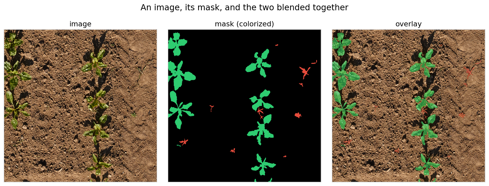
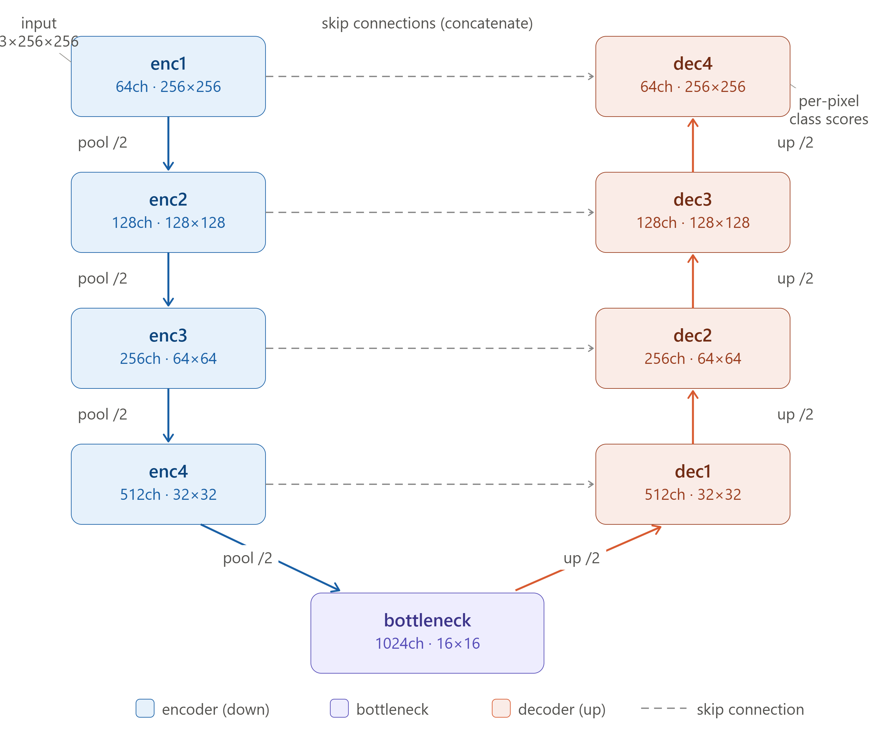
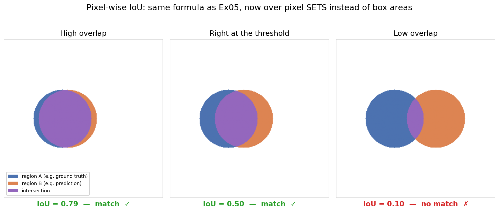
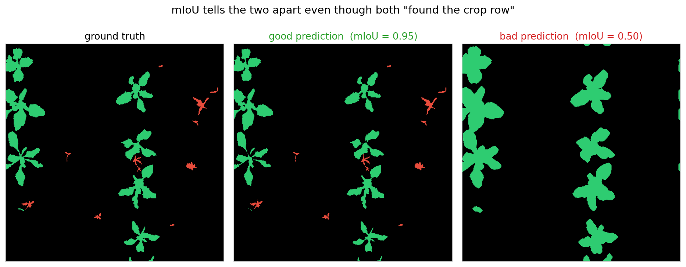

# Exercise 06: Semantic Segmentation with U-Net

## Overview

In this exercise, you will build a semantic segmentation pipeline to classify every pixel in an image as background, crop, or weed. You will use the same [PhenoBench](https://www.phenobench.org/) dataset as Exercise 05, but instead of predicting bounding boxes, the model predicts a class label for each pixel.

The baseline model is **U-Net**, which you will build from scratch. Pretrained alternatives (DeepLabV3, FCN) are available via the model factory, following the same swap-via-config pattern from previous exercises.

**Estimated time:** 4–5 hours

**Prerequisites:** Exercise 05 (object detection pipeline)

**References:**
- [pytorch/vision/references/segmentation](https://github.com/pytorch/vision/tree/main/references/segmentation) — official PyTorch segmentation reference
- Ronneberger et al., ["U-Net: Convolutional Networks for Biomedical Image Segmentation"](https://arxiv.org/abs/1505.04597) (2015) — the original U-Net paper

**File structure:**
```
exercise_06/
├── README.md                 ← You are here
├── config.yaml               ← Segmentation configuration
├── submit_slurm.sh              ← Slurm submission script for training
├── submit_slurm_eval.sh         ← Slurm submission script for evaluation on testset
├── src/
│   ├── dataset.py            ← TODO: Segmentation dataset
│   ├── visualize_dataloader.py ← Fully coded (visualize the training data with bboxes before training)
│   ├── transforms.py         ← TODO: Joint image-mask transforms
│   ├── model.py              ← TODO: U-Net + model factory
│   ├── train.py              ← TODO: Training loop
│   ├── evaluate.py           ← TODO: Segmentation metrics (standalone)
│   └── utils.py              ← Fully coded (helpers, visualization)
├── solutions/
├── assets/                   ← Figures embedded in this README
├── data/                     ← Symlink to shared dataset
└── outputs/
    ├── checkpoints/
    └── logs/
```

---

## Dataset Setup

The PhenoBench segmentation data is pre-prepared on the server with pixel masks. Create a symlink:

```bash
ln -s /ai2_ex/data/segmentation/phenobench_256 data/phenobench_256
```

### Expected Folder Structure

```
data/phenobench/
├── train/
│   ├── images/               ← RGB images (PNG)
│   └── masks/                ← Semantic masks (PNG, pixel values = class IDs)
└── val/
    ├── images/
    └── masks/
```

### Mask Values

Each mask pixel contains a class index:

| Pixel value | Class |
|-------------|-------|
| 0 | Background (soil) |
| 1 | Crop (sugar beet) |
| 2 | Weed |

---

# Part I: Concepts

---

## 1. From Detection to Segmentation: What Changes

Every component of the pipeline changes when moving from detection to segmentation. Here is a direct comparison with Exercise 05.

### What the model predicts

**Detection:** A list of bounding boxes, each with a class label and confidence score.

**Segmentation:** A class label for every single pixel. The model output is a tensor of shape `(B, num_classes, H, W)` — one score per pixel per class, same spatial size as the input image.

### Annotation format

**Detection:** COCO JSON with bounding box coordinates per object.

**Segmentation:** A mask image (PNG) with the same dimensions as the input image. Each pixel's value is the class index. No JSON files — the mask image *is* the annotation.

### How the Dataset changes

**Detection:** `__getitem__` returned `(image, target_dict)` with boxes, labels, areas, etc.

**Segmentation:** `__getitem__` returns `(image, mask)` where the mask is a 2D tensor of shape `(H, W)` with integer class indices. Simpler than detection — no variable-length target dicts.

### How the DataLoader changes

**Detection:** Needed a custom `collate_fn` because different images had different numbers of objects.

**Segmentation:** The default `collate_fn` works. All images are resized to the same dimensions, and every mask has the same shape. Standard batching stacks them into `(B, C, H, W)` for images and `(B, H, W)` for masks.

### How transforms change

**Detection:** Bounding box coordinates had to be updated with coordinate math when the image was flipped or resized.

**Segmentation:** The mask must undergo the same spatial transforms as the image (flip, resize, crop), but no coordinate math is needed — just apply the same operation to both. Two critical rules:

- **Never apply color augmentations to the mask** (ColorJitter, Normalize) — those are image-only. The mask contains class indices, not pixel values.
- **Never resize the mask with bilinear interpolation** — use nearest-neighbor. Bilinear interpolation would average neighboring class indices, creating invalid values like 0.5 between background and crop.

### How the loss changes

**Detection:** The model computed its own multi-task loss internally (classification + box regression + objectness + RPN).

**Segmentation:** You use an explicit loss function, like classification. `nn.CrossEntropyLoss` works directly — it compares the model output `(B, num_classes, H, W)` with the target mask `(B, H, W)`. Each pixel is treated as an independent classification problem.

### Summary table

| | Ex05 (detection) | Ex06 (segmentation) |
|---|---|---|
| Label per image | 0 to N boxes, each with a class | One class per pixel (dense H×W grid) |
| Annotation format | COCO JSON (boxes) | A second image (the mask) |
| Transform pipeline | Moves boxes with the image | Moves a same-size mask with the image |
| Model output | List of (box, class, score) per image | Full-resolution H×W×class map |
| Model shape | Backbone → detection heads | Encoder → decoder with skip connections |
| Loss | Multi-term (internal to model) | Single `nn.CrossEntropyLoss`, per pixel |
| Metric | mAP (rank predictions, match by IoU) | mIoU (direct pixel-set overlap, no ranking) |
| DataLoader | Custom `collate_fn` | Default collate |

---

## 2. Segmentation Masks

A segmentation mask is a second image, the same height and width as the input photo, where every pixel's *value* is a class index — here, 0 (background), 1 (crop), or 2 (weed). There is no annotation format to parse (no COCO JSON) — the mask already has exactly the shape you want to predict.

Opening a mask in a normal image viewer shows almost nothing — pixel values 0/1/2 are indistinguishable from black to the human eye. `utils.py` provides `colorize_mask()` and `overlay_mask()` to visualize them.



---

## 3. U-Net Architecture

U-Net is an encoder-decoder architecture with skip connections, originally designed for biomedical image segmentation. It is the standard baseline for dense prediction tasks.

### Encoder

Downsamples the image through repeating Conv-BN-ReLU blocks with MaxPool2d between each stage. Structurally identical to a classification CNN's backbone — deeper stages see a bigger receptive field and more abstract features, at the cost of spatial resolution.

Channel progression: 3 (RGB) → 64 → 128 → 256 → 512.

### Bottleneck

The deepest block (512 → 1024 channels) at the lowest spatial resolution. Contains the most compressed representation of the input.

### Decoder

Reverses the downsampling using `ConvTranspose2d` (learned upsampling), climbing back to the original resolution. Each stage halves the channel count and doubles the spatial dimensions.

### Skip Connections

The key innovation. Each encoder stage's output is concatenated with the corresponding decoder stage's output at the *same* resolution, before the decoder's ConvBlock runs.

Why? By the bottleneck, pooling has discarded most fine spatial detail — exact leaf edges, thin weed stems. The decoder can recover *what* was there from the bottleneck's abstract features, but not *where exactly* it was. Skip connections carry that high-resolution spatial information directly from encoder to decoder, bypassing the bottleneck. Without them, segmentation boundaries are blurry; with them, they are sharp.



---

## 4. Available Segmentation Models

All models share the same API: input `(B, 3, H, W)` → output `(B, num_classes, H, W)`. Swap via `model.name` in `config.yaml`.

Note: torchvision models (DeepLabV3, FCN) return a dict `{"out": tensor}` instead of a plain tensor. Handle this in the training/eval loop with `if isinstance(output, dict): output = output["out"]`.

## Transformer-based Segmentation

CNN segmentation (U-Net) relies on **local** operations — each 3×3 convolution sees only its immediate neighborhood. To capture context beyond that, you stack many layers and use pooling, which loses spatial detail. Skip connections were invented specifically to recover that lost detail.

Transformer segmentation uses **self-attention**, which relates every pixel (or patch) to every other in a single operation. This fundamentally changes two things:

- **Long-range context is immediate**: a weed plant at the top of the image can inform classification of a similar plant at the bottom, without needing the information to propagate through dozens of layers.
- **Skip connections become unnecessary**: spatial detail is preserved throughout because there is no aggressive pooling. The decoder can be much simpler — SegFormer uses a lightweight MLP instead of a full decoder with transposed convolutions.

### SegFormer

SegFormer is a hierarchical transformer encoder paired with a simple MLP decoder. Key design choices:

- **Hierarchical features**: Unlike ViT which processes the image at a single resolution, SegFormer produces feature maps at 1/4, 1/8, 1/16, and 1/32 of the input — similar to how CNN backbones (ResNet) produce multi-scale features. This is important for segmentation where objects appear at different scales.
- **Overlapping patch embeddings**: Instead of cutting the image into non-overlapping patches (like ViT), SegFormer uses overlapping patches. This preserves local continuity at patch boundaries, which matters for dense prediction.
- **No positional encoding**: SegFormer uses Mix-FFN with depth-wise convolutions instead of fixed positional embeddings. This makes it robust to different input resolutions at test time.
- **Lightweight MLP decoder**: The decoder simply projects multi-scale features to a common dimension, concatenates them, and applies a final classification layer. No transposed convolutions, no skip connections.
- **Multiple sizes**: B0 (~3.7M params, fast) through B5 (~85M params, best accuracy). B0 is suitable for the course; B2 offers a good speed/accuracy trade-off.

### How SegFormer integrates with the exercise

The `SegFormerWrapper` class in `model.py` handles one key difference: SegFormer outputs logits at 1/4 of the input resolution. The wrapper upsamples them to full resolution internally using bilinear interpolation, so `train.py` and `evaluate.py` receive `(B, num_classes, H, W)` — exactly the same shape as U-Net and DeepLabV3.

`train.py`, `evaluate.py`, `dataset.py`, and `transforms.py` need **zero changes**. Only `config.yaml`:

```yaml
model:
  name: "segformer_b0"
```

### CNN vs Transformer Segmentation — Comparison

| | CNN (U-Net) | Transformer (SegFormer) |
|---|---|---|
| Context | Local (3×3 per layer, grows with depth) | Global (full image via self-attention) |
| Encoder | Conv-BN-ReLU blocks + MaxPool | Hierarchical transformer blocks |
| Decoder | Full decoder with ConvTranspose2d | Lightweight MLP |
| Skip connections | Essential for sharp boundaries | Not needed |
| Spatial detail | Lost by pooling, recovered by skips | Preserved throughout |
| Pretrained weights | Helpful | Essential (transformers are data-hungry) |
| Training from scratch | Feasible on small datasets | Impractical without pretraining |

### Model Table

| Model | Config name | Type | Params | Architecture |
|-------|------------|------|--------|-------------|
| U-Net | `unet` | CNN | ~31M | Encoder-decoder + skip connections |
| DeepLabV3 (ResNet-50) | `deeplabv3_resnet50` | CNN | ~40M | Atrous convolutions + ASPP |
| FCN (ResNet-50) | `fcn_resnet50` | CNN | ~33M | Fully convolutional |
| SegFormer-B0 | `segformer_b0` | Transformer | ~3.7M | Hierarchical transformer + MLP decoder |
| SegFormer-B2 | `segformer_b2` | Transformer | ~27M | Larger transformer + MLP decoder |

---

## 5. Evaluation Metrics

Detection evaluation used mAP — ranking predictions by confidence, matching to ground truth via IoU. Segmentation is simpler: every pixel has exactly one prediction and one ground truth label, so there is nothing to rank or match.

### Pixel Accuracy

The simplest metric — what fraction of pixels were classified correctly?

```
Pixel Accuracy = correct pixels / total pixels
```

Easy to compute but misleading when classes are imbalanced. PhenoBench is roughly 88% background, 12% crop, 0.5% weed. A model that predicts "background everywhere" gets ~88% pixel accuracy while being completely useless for finding crops and weeds.

### Pixel-wise IoU (per class)

The same Jaccard formula as Exercise 05, but computed over sets of pixels instead of box areas:

```
IoU(class) = |{pixels where pred == c AND target == c}|
             / |{pixels where pred == c OR  target == c}|
```

IoU ranges from 0 (no overlap) to 1 (perfect overlap). Computed separately for each class.



### mIoU (Mean Intersection over Union)

The primary segmentation metric — the mean of per-class IoU values:

```
mIoU = (IoU_background + IoU_crop + IoU_weed) / 3
```

mIoU treats all classes equally regardless of pixel count. This is the critical difference from pixel accuracy — a model that ignores the rare weed class gets punished because weed IoU would be zero, dragging the mean down.



Both predictions above "found the crop row" — the difference (missing all weed instances) is exactly what mIoU catches and pixel accuracy would miss.

### Dice Coefficient

Also called F1-score for segmentation. Similar to IoU but slightly more lenient:

```
Dice(class) = 2 × TP / (2 × TP + FP + FN)
```

Dice is always ≥ IoU for the same prediction. Related by: `Dice = 2 × IoU / (1 + IoU)`. They rank models identically — if model A has higher IoU than model B, it also has higher Dice. The numbers just differ in magnitude. Commonly used in medical image segmentation.

### Reading the Evaluation Output

When you run evaluation, the script prints:

```
Pixel Accuracy: 0.8542
mIoU: 0.6231

Per-class results:
  background  — IoU: 0.9012  Dice: 0.9481
  crop        — IoU: 0.5834  Dice: 0.7370
  weed        — IoU: 0.3847  Dice: 0.5554
```

Weed IoU is typically lower because weeds are small and varied in appearance. This is expected.

---

## 6. Optional Advanced Topics

Complete scripts in `optional/` for instructor demonstration:

| Script | Topic |
|--------|-------|
| `optional/visualize_predictions.py` | Draw predicted and ground truth boxes on images |

---

# Part II: Exercises

Work through each script in order. Open the file, look for `# TODO`
markers, write your solution, and run the script to verify.

---

### Exercise A — Segmentation transforms (section 1)

**→ Open `src/transforms.py` and complete the TODOs.**

Covers: building custom transform classes that operate on `(image, mask)` pairs. `ToTensor` must handle image (scale to [0, 1]) and mask (integer indices, no scaling) differently. `Resize` must use nearest-neighbor interpolation for the mask. `RandomHorizontalFlip` and `RandomVerticalFlip` apply the same flip to both. `ColorJitter` and `Normalize` apply to image only.

Verify: `python src/transforms.py`

This creates a dummy image and mask, applies transforms, and prints shapes and unique mask values. If mask values contain anything other than 0, 1, 2 after transforms, something is wrong.

---

### Exercise B — Segmentation dataset (section 2)

**→ Open `src/dataset.py` and complete the TODOs.**

Covers: scanning `images/` and `masks/` directories, pairing them by filename, loading the mask without converting to RGB, applying joint transforms.

Verify: `python src/dataset.py`

This loads the training set, prints total images, mask shapes, unique values, per-class pixel distribution, and fetches one batch to confirm shapes.

---

### Exercise B.1 — Verify the dataloader visually

After completing `dataset.py` and `transforms.py`, verify visually:

```bash
python src/visualize_dataloader.py --config config.yaml
```

Open `outputs/visualizations/seg_dataloader_train.png` and check that masks align with plants, colors are correct (green=crop, red=weed), and mask values are only 0, 1, 2.

---

### Exercise C — U-Net architecture (section 3)

**→ Open `src/model.py` and complete the TODOs.**

Covers: defining the U-Net encoder (4 ConvBlocks with pooling), bottleneck, decoder (4 ConvTranspose2d + skip concatenation + ConvBlock), and final 1×1 Conv head. Also: the model factory for DeepLabV3/FCN head replacement and SegFormer wrapper.

Verify: `python src/model.py`

This passes a dummy input through each model and verifies output spatial dimensions match the input.

---

### Exercise D — Utility functions

`src/utils.py` is fully coded — no TODOs. Read through it to understand:

- `set_seed`: reproducibility.
- `save_checkpoint` / `load_checkpoint`: model state persistence.
- `colorize_mask`: converts a (H, W) class mask to an RGB image for visualization.
- `overlay_mask`: blends a colorized mask onto its (normalized) image for inspection.
- `denormalize`: reverses ImageNet normalization for display.

---

### Exercise E — Segmentation evaluation (section 5)

**→ Open `src/evaluate.py`, no TODOs here.**

Covers: building a confusion matrix from predictions and targets, computing pixel accuracy / per-class IoU / mIoU / per-class Dice / mean Dice from the confusion matrix, accumulating over all validation batches. Handles torchvision dict output (`output["out"]`).

This script is imported by `train.py`.

It can also be run standalone after training to evaluate on the test set (see Exercise H).

---

### Exercise F — Training script (section 1)

**→ Open `src/train.py` and complete the TODOs.**

Requires: all previous scripts completed (imports from each, including `evaluate()` from `evaluate.py`).

Covers: creating datasets/dataloaders (default collate — no custom `collate_fn` needed), instantiating model/loss/optimizer, the training step (handles torchvision dict output), validation via `evaluate()` imported from `evaluate.py`, TensorBoard logging (loss, mIoU, pixel accuracy), and best-checkpoint saving based on mIoU.

---

### Exercise G — Run training

Submit the training job via Slurm:

```bash
sbatch submit_slurm.sh
```

Monitor the job:

```bash
# Check job status
squeue -u $USER

# View output while running
tail -f outputs/logs/slurm_*.out

# View errors
cat outputs/logs/slurm_*.err
```

---

### Exercise H — Evaluate on test set

After training completes, evaluate the best checkpoint on the held-out test set.

Edit `slurm_submit_eval.sh` if needed — update the checkpoint path to match your best saved model. Then submit:

```bash
sbatch slurm_submit_eval.sh
```

Check the results:

```bash
cat outputs/logs/eval_*.out
```

This prints the segmentation evaluation metrics. By default it evaluates on the **test** split. To evaluate on val instead, edit the last line in `slurm_submit_eval.sh`:

```bash
python src/evaluate.py --config config.yaml \
    --checkpoint outputs/checkpoints/phenobench_unet_best.pt \
    --split val
```

---

### Exercise I — TensorBoard

```bash
tensorboard --logdir outputs/logs --port 6006 --bind_all
```

You will see:
- **Loss/train** — training loss per epoch
- **mIoU/val** — primary metric per epoch
- **PixelAcc/val** — pixel accuracy per epoch

---

### Exercise J — Compare models

1. Train with `unet` (baseline you built from scratch).
2. Change `model.name` in `config.yaml` to `deeplabv3_resnet50` and set a different `experiment_name`.
3. Compare in TensorBoard — pretrained DeepLabV3 should converge faster and achieve higher mIoU.

For SegFormer, use `config_segformer.yaml` with `optimizer: "adamw"` and `learning_rate: 0.00006` — transformer models require different training settings (see README Part I: Transformer-based Segmentation).

---

### Exercise K — Push to GitHub

```bash
git add src/
git commit -m "Complete exercise 06: semantic segmentation with U-Net"
git push
```
---

## Summary

| Component | File | What changed from detection |
|-----------|------|----------------------------|
| Annotations | PNG masks | COCO JSON → mask images where pixel value = class |
| Dataset | `src/dataset.py` | Returns `(image, mask)` instead of `(image, target_dict)` |
| Transforms | `src/transforms.py` | Same spatial ops to both image and mask, no coordinate math |
| DataLoader | Default collate | No custom collate_fn needed (all masks same shape) |
| Model | `src/model.py` | Encoder-decoder (U-Net) instead of region-based (Faster R-CNN) |
| Loss | `nn.CrossEntropyLoss` | Explicit loss function again (not internal to model) |
| Evaluation | `src/evaluate.py` | mIoU + Dice instead of mAP |
| Output shape | `(B, C, H, W)` | Dense prediction map instead of list of detections |
