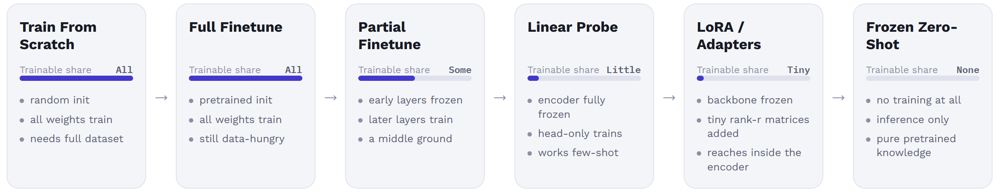
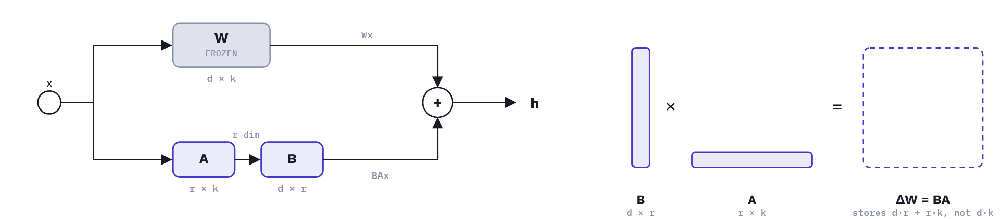
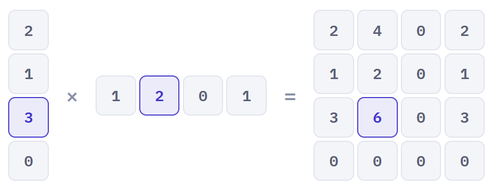

# Exercise 08: The Finetuning Toolbox — PEFT, Distillation, and What Comes Next

## Overview

Exercises 03–07 built a specific skill each time — training from scratch,
detecting, segmenting, and finetuning few-shot. This exercise steps back
and asks: what's the rest of the toolbox? LoRA, knowledge distillation, and
a handful of other parameter-efficient finetuning (PEFT) methods all solve
variations on the same problem Ex07 introduced — adapting a big pretrained
model cheaply — and a final project is far more likely to need *awareness*
of these options than a from-scratch implementation of all of them. This
exercise trades depth for breadth: two small hands-on coding tasks (LoRA,
distillation), one research-lookup task, one group jigsaw survey of the
wider PEFT landscape, and a closing group discussion — all explicitly kept
high-level.

**Estimated time:** 1.5–2 hours

**Prerequisites:** Exercise 05/06 (transfer learning basics), Exercise 07
(few-shot finetuning — you'll compare this exercise's LoRA
trainable-parameter count against Ex07's own printed linear-probe and, if
you did it, partial-unfreeze counts, so keep those numbers on hand)

**Setup:** `pip install peft` — this exercise's only new dependency;
`torch` and `transformers` are already installed from Ex06/Ex07.

**References:**
- Hu et al., ["LoRA: Low-Rank Adaptation of Large Language Models"](https://arxiv.org/abs/2106.09685) (2021)
- Hinton, Vinyals & Dean, ["Distilling the Knowledge in a Neural Network"](https://arxiv.org/abs/1503.02531) (2015)

**File structure:**
```
exercise_08/
├── README.md                     ← You are here
├── assets/                       ← Diagrams referenced in this README
├── src/
│   ├── lora_demo.py               ← TODO: wrap a pretrained SegFormer with peft LoRA
│   └── distillation_loss.py       ← TODO: the distillation loss function only
├── solutions/
├── handouts/                      ← One-pager per jigsaw station (Section 4) — not written yet
└── worksheet.md                   ← Group deliverable template
```

There is no `data/`, `config.yaml`, or `outputs/checkpoints/` here — this
exercise consumes what Ex06/Ex07 already produced rather than training
anything new from scratch.

---

# Part I: Concepts

---

## 1. Where This Sits: Closing the Transfer-Learning Loop

Before anything new, place what you've already built on one spectrum:



"How much of the model do I retrain, and on how much data" is one
continuous design axis, not a set of unrelated techniques to memorize —
everything else in this exercise is more points on the same axis.

---

## 2. LoRA, Applied to What You Already Built

LoRA freezes a pretrained weight matrix `W` and learns a low-rank update
`ΔW = BA` (two small matrices) alongside it, so the number of trainable
parameters depends on the chosen rank `r`, not on the size of `W`.



Two things to take from this picture. On the left, the forward pass: `x`
runs through the frozen `W` and, in parallel, through the trainable pair
`A → B`; only that second path collects gradients, and the two outputs are
summed into `h = Wx + BAx`. On the right, the shapes: `B` (`d×r`, tall)
and `A` (`r×k`, wide) multiply back out to a full `d×k` matrix — the same
shape `W` is — but only ever *store* `d·r + r·k` numbers, never the full
`d·k`.

Worth being precise about: `A` and `B` don't approximate `W` itself — `W`
stays exactly as pretrained, frozen and untouched. They approximate `ΔW`,
the *update* that ordinary finetuning would otherwise apply directly to
`W`. LoRA's bet is that this update, not the weight matrix itself, behaves
like a low-rank matrix.

**Rank decomposition, concretely:** a matrix has rank 1 if every row is
just a scaled copy of the same pattern — and when that's true, the whole
matrix can be rebuilt exactly from one column and one row, which is a
low-rank decomposition with `r = 1`.



`u` (4×1) times `v` (1×4) reconstructs `M` (4×4) exactly — every entry is
just `uᵢ × vⱼ`. That's **16 numbers** stored directly as `M`, versus **8
numbers** stored as factors (`u`'s 4 plus `v`'s 4) — same matrix, half the
storage, because `M` really is rank 1.

A real weight matrix isn't exactly low-rank the way this toy example is —
but LoRA doesn't need `W` to be low-rank, only the *finetuning update* to
be well-approximated by one. Scale the same arithmetic up: an ordinary
768×768 transformer weight matrix holds 589,824 numbers. At `r = 8` — the
setting used below — `B` and `A` together store `768×8 + 8×768 = 12,288`,
about 2% of the original.

The HuggingFace `peft` library's `target_modules="all-linear"` finds every
`nn.Linear` layer in a model automatically, so this works without knowing
SegFormer's exact internal layer names (which, as Ex07 found out, can
change between `transformers` versions). One thing `"all-linear"` *won't*
reach: SegFormer's decode head classifier is a 1×1 `Conv2d`, not a
`Linear` layer, so it has to be listed explicitly in `modules_to_save` to
stay trainable — otherwise it stays frozen at its randomly
re-initialized weights and the model can never actually learn
PhenoBench's 3 classes, LoRA-adapted encoder or not:

```python
from peft import LoraConfig, get_peft_model

lora_config = LoraConfig(
    r=8,
    lora_alpha=16,
    target_modules="all-linear",     # finds every nn.Linear layer automatically
    modules_to_save=["decode_head"], # Conv2d, not Linear -- "all-linear" can't reach it
)
lora_model = get_peft_model(base_segformer_model, lora_config)
lora_model.print_trainable_parameters()
```

---

## 3. Knowledge Distillation: Teachers and Students

A large, accurate "teacher" model's output probabilities carry more
information than its hard labels alone — including how confused it is
between similar classes (e.g. crop vs. a crop-like weed). Distillation
trains a smaller "student" to match the teacher's *softened* probability
distribution (via a temperature `T`), not just the correct label:

```python
import torch.nn.functional as F

def distillation_loss(student_logits, teacher_logits, labels, temperature=4.0, alpha=0.5):
    soft_loss = F.kl_div(
        F.log_softmax(student_logits / temperature, dim=-1),
        F.softmax(teacher_logits / temperature, dim=-1),
        reduction="batchmean",
    ) * temperature ** 2
    hard_loss = F.cross_entropy(student_logits, labels)
    return alpha * soft_loss + (1 - alpha) * hard_loss
```

The soft-label term (KL divergence over temperature-softened
probabilities) is what makes this different from just training a small
model on the same hard labels from scratch — it lets the student learn
from *how confused* the teacher is between classes, not just which class
was correct. In practice, most people reach for a model someone else has
already distilled on the Hub (Exercise D) rather than distilling one
themselves.

---

## 4. The Broader PEFT Landscape

LoRA and distillation above are this exercise's two hands-on methods;
adapters, prompt tuning, BitFit, IA3, and QLoRA round out the wider PEFT
toolbox. All of them tackle the same problem as LoRA — adapting a large
pretrained model without retraining all of it — but differ in what they
freeze, what (if anything) they add, and how well-validated they are for
vision, since most were developed and tested on language models first.

**Methods, ranked by fit to a vision/segmentation course** (where a
genuine vision-specific version exists, it's listed as the primary
resource):

| Rank | Method | What it does | Resources |
|---|---|---|---|
| 1 | **Adapters** | Inserts small trainable bottleneck layers (down-project → nonlinearity → up-project) inside each frozen transformer block; only the inserted layers train. ViT-Adapter is the vision-specific version, built for dense prediction — detection and semantic segmentation. | Original: [Houlsby et al., ICML 2019](https://proceedings.mlr.press/v97/houlsby19a/houlsby19a.pdf). Vision-specific: [ViT-Adapter, ICLR 2023](https://arxiv.org/abs/2205.08534). Docs: [AdapterHub overview](https://docs.adapterhub.ml/overview.html) |
| 2 | **Prompt Tuning** | Prepends a handful of trainable "soft" embedding vectors to the input sequence; the frozen model attends to them, and only those vectors are learned. Visual Prompt Tuning is the ViT version, reported to help most with limited training data. | Original: [Lester et al., 2021](https://arxiv.org/abs/2104.08691), [Li & Liang (Prefix-Tuning), ACL 2021](https://arxiv.org/abs/2101.00190). Vision-specific: [Visual Prompt Tuning, ECCV 2022](https://arxiv.org/abs/2203.12119). |
| 3 | **BitFit** | Freezes every weight matrix and trains only the network's existing bias terms — nothing new is added, nothing else moves. | Paper: [Zaken, Goldberg & Ravfogel, ACL 2022](https://arxiv.org/abs/2106.10199). |
| 4 | **IA3** | Learns small per-layer vectors that rescale (multiply) attention keys/values and feedforward activations, rather than learning an additive weight update the way LoRA does. | Paper: [Liu et al., NeurIPS 2022](https://arxiv.org/abs/2205.05638). Docs: [HuggingFace PEFT — IA3](https://huggingface.co/docs/peft/en/package_reference/ia3) |
| 5 | **QLoRA** | Quantizes the frozen base model to 4-bit precision, then trains ordinary LoRA adapters on top of it — so a very large model fits, and finetunes, in far less GPU memory. | Paper: [Dettmers et al., 2023](https://huggingface.co/papers/2305.14314) |

---

## 5. Deployment Tradeoffs

PEFT and distillation are both, at bottom, answers to a deployment
constraint — memory, latency, or storage-per-task — not abstract
techniques to collect. If time allows, Exercise F connects today's methods
back to a concrete target instead of leaving them theoretical.

---

# Part II: Exercises

---

### Exercise A — Place Ex03/05/06/07 on the transfer-learning spectrum (Section 1)

**Group Work.** As a group, place the training methods from Ex03, Ex05, Ex06, and Ex07 on the transfer-learning spectrum from Section 1, and justify each placement in
one sentence. Record your group's placements in `worksheet.md`.

---

### Exercise B — LoRA-wrap a pretrained SegFormer (Section 2)

**→ Open `src/lora_demo.py` and complete the TODOs.**

Covers: loading the same pretrained SegFormer checkpoint Ex07 used,
wrapping it with `peft`'s `LoraConfig(r=8, lora_alpha=16,
target_modules="all-linear", modules_to_save=["decode_head"])`, and
reading off the trainable-parameter count.

Verify: `python src/lora_demo.py`. Then, in `worksheet.md`, put three
numbers side by side — Ex07's linear-probe (head-only) trainable count,
Ex07's optional partial-unfreeze count, and this LoRA count — and explain
where LoRA sits between them and *why* (it touches parameters inside the
frozen encoder itself, unlike linear-probe, but far fewer of them than
partial unfreezing touches).

---

### Exercise C — Implement the distillation loss (Section 3)

**→ Open `src/distillation_loss.py` and complete the TODOs.**

Covers: the temperature-scaled KL term plus the hard-label cross-entropy
term, tested against two provided toy logit tensors — no training loop.

Verify: `python src/distillation_loss.py` — checks your loss value against
a known reference on the provided toy tensors.

---

### Exercise D — Find a distilled model on the Hub (Section 3)

No code. Search the HuggingFace Hub for one model described as distilled
from a larger one (e.g. a DistilBERT-style or distilled ViT/vision model),
and note its parameter count and reported accuracy/latency trade-off
versus its teacher in `worksheet.md`.

---

### Exercise E — PEFT jigsaw stations (Section 4)

**Group Work.** The instructor assigns each group one method from the
table in Section 4 — groups don't self-select.

Using only your assigned method's resource links, spend about 15–20
minutes answering the same three questions as every other group:

1. What exactly is frozen vs. trained?
2. Roughly how few parameters does it add (a number or percentage from the paper)?
3. What's one result or number from the paper that surprised your group?

Record your answers in `worksheet.md`, then present them back to the full
group in about 2 minutes.

---

### Exercise F — (Optional) Deployment tradeoffs discussion (Section 5)

**Group Work, ~10 minutes if time allows.** Discuss: "your final project
needs to run on \[a laptop / an edge device / a phone\]. Which of today's
techniques would you actually reach for, and why?" Record your group's
answer in `worksheet.md`.

---

### Exercise G — Push to GitHub

```bash
git add worksheet.md src/
git commit -m "Complete exercise 08: PEFT, distillation, and the finetuning landscape"
git push
```

---

## Summary

| Component | What's new vs. Ex01–07 |
|-----------|--------------------------|
| LoRA | First hands-on parameter-efficient method that touches the frozen backbone itself, compared directly against Ex07's frozen/partial/full numbers |
| Distillation | First exercise involving two models at once (teacher + student) and a loss with two competing terms |
| PEFT breadth | A ranked, vision-fit-aware map of the wider landscape (adapters, prompt tuning, BitFit, IA3, QLoRA), not just LoRA in isolation |
